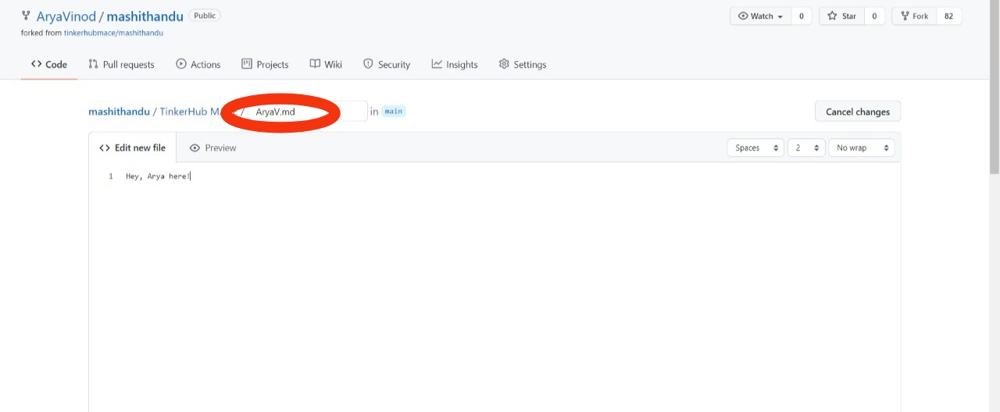
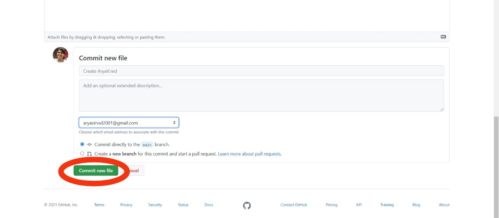
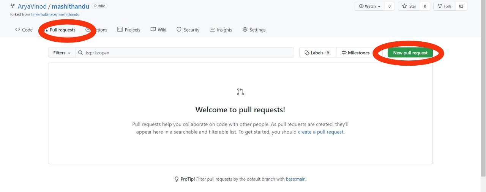
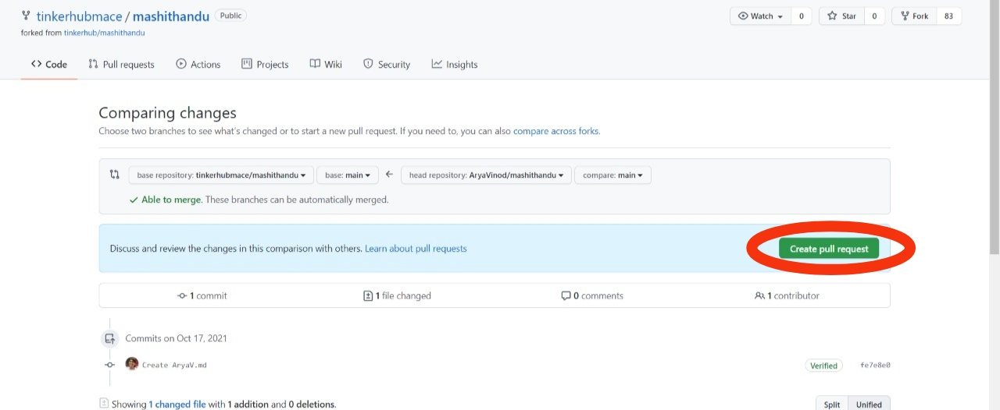

# TinkerHub MACE
### All set to make your first contribution? Here we go! 💥

###  Just 3 steps 💡
1️⃣ Create a fork of this repo (tinkerhubmace/mashithandu) to your account.

2️⃣ Create a readme file with your name (eg: Kiran.md) inside 'TinkerHub Mace' folder and add your contribution. (How about you introduce/write something about yourself!😎 ) 
Ensure that you're currently working on the repo you forked into your account.

3️⃣ Create a pull request.

### Creating a pull request

After committing and pushing your changes go to your fork and create a pull request to the repo (tinkerhubmace/mashithandu). Make sure you give a good title and description for your pull request.

## Resources

A list of Git/GitHub-related resources that might be helpful here. 🤩  
<a href='https://guides.github.com/introduction/git-handbook/'> Git-Handbook </a>

## Contacts

Have any queries? Do reach out to our Tech Leads 💯

Kiran S Baliga - kiransbaliga@gmail.com
Athul John - athulpulickaljohn@gmail.com
