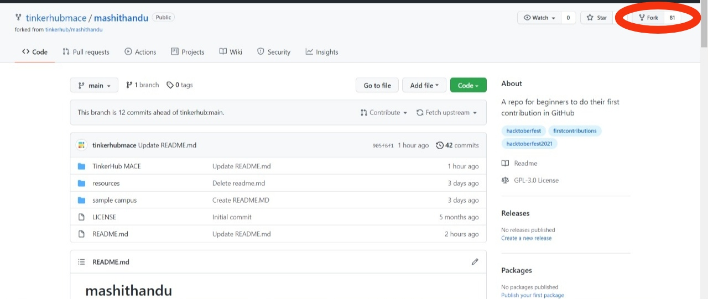
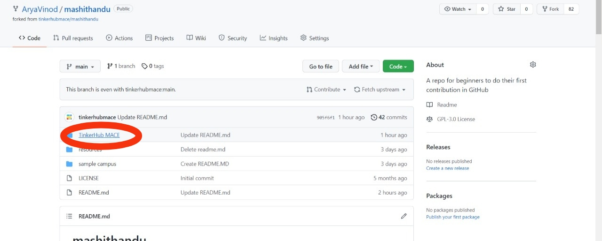
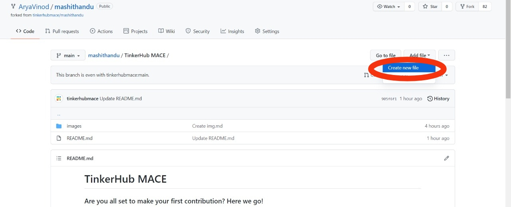

# TinkerHub MACE
### Are you all set to make your first contribution? Here we go!

###  Just 3 steps 💡
- Create a fork of this repo (tinkerhubmace/mashithandu) to your account.
 

 
- Create a readme file with your name (eg: Kiran.md) inside 'TinkerHub Mace' Folder and add your contribution. (How about you introduce or write something about yourself!)
 

 

 
- Create a pull request.

### Creating a pull request

After committing and pushing your changes go to your fork and create a pull request to the repo (tinkerhubmace/mashithandu). Make sure you give a good title and description for your pull request.

## Resources

A list of Git/GitHub-related resources that might be helpful here.
<a href='https://guides.github.com/introduction/git-handbook/'> Git-Handbook </a>

## Contacts

The contact points students/TinkerHub can reach out to if needed.

Lead Name - mail-id/phno/discord-id
For support - mail-id/phno/discord-id 
